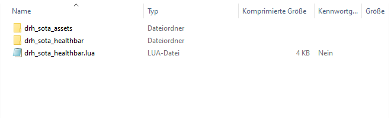
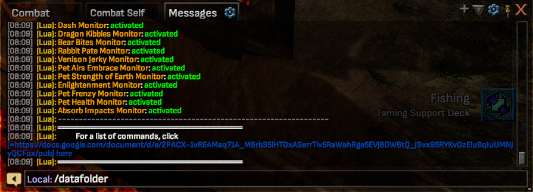
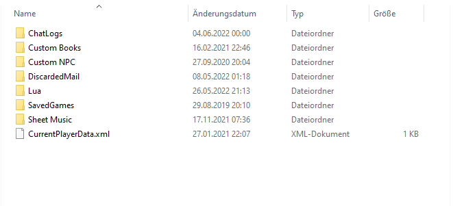
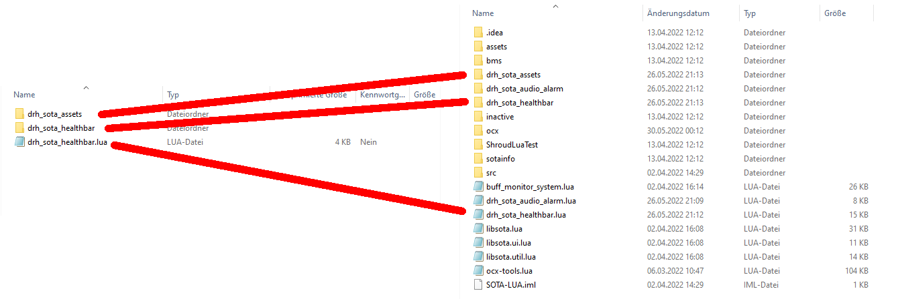
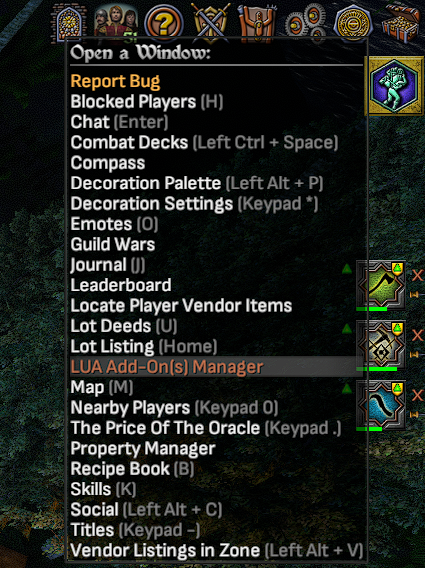
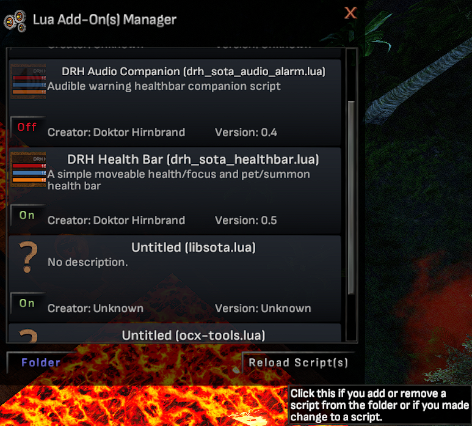

# Lua Add-On(s) for Shroud of the Avatar

- [drh_sota_healthbar](drh_sota_healthbar/README.md)

A simple moveable healthbar that shows player health/focus and summon/pet health.

- [drh_sota_alarm](drh_sota_alarm/README.md)

An alarm tool that plays a warning audio file when health or focus drops below 33% and
stops playing that alarm when health or focus recovers to 50%.

## Installation

- It is not required to exit the game client to install or update the lua add-ons.

### 1. Download the ZIP archive

The archives are hosted on github.com ->
[Link to the Releases page](https://github.com/drhirnbrand/sota_lua/releases)

### 2. Unpack the ZIP file to a temporary location

After downloading the zip file(s), you can extract them to a temporary location,
or open them in the explorer. To open a zip archive in the explorer, **double click** on the archive
in the explorer window.

Inside the zip archive there should be a main lua file. This one is called `drh_sota_healthbar.lua`.
In addition to the main lua file, there may be one or more additional folders.
These folders may contain
- sound and image assets used by the plugin
- default user settings, such as text sizes and window positions

### 3. Move the files to the LUA plugin directory

Open the user's SOTA data storage folder by typing `/datafolder` into the in-game local chat window.
It is not required to use local chat, but you avoid spamming universe chat in case the something goes wrong.

The `/datafolder` command will open a windows file explorer window pointing to
the data storage folder of the currenlty running SOTA instance.
The content might look similar to the image shown below.

Depending on your past interactions with the game client, some of the directories
will not be present.
If the folder named `Lua` does not exist yet, simply create a directory with the name `Lua`.

In the next step, copy the files from the zip archive into the `Lua` directory.
Copy them exactly as stored in the zip archive. Merge contents into the target directories, if it already exists.
All my scripts share images and sounds in the `drh_sota_assets` folder.

### 4. Reload the scripts in the in-game LUA Add-On(s) manager

To activate the new add-ons, you need to re-load the lua folder from within the game client.

* Option 1: From local chat

> Type `/lua reload` into the local chat, and all the add-ons will be reloaded.

- Option 2: Using the in-game Lua Add-On(s) Manager

> Open the Lua manager from the in-game menu in the top right corner.

> Use the button `Reload Script(s)` to perform a reload of all add-ons.

 